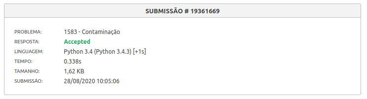
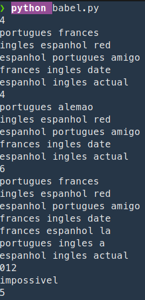
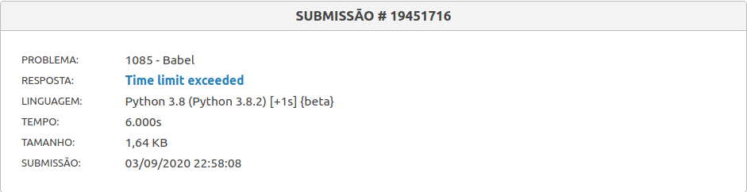

# Projetos URI

**Número da Lista**: 1 
**Conteúdo da Disciplina**: Grafos 1 

## Alunos
|Matrícula | Aluno |
| -- | -- |
| 16/0014433  |  Maria Luiza Ferreira |
| 15/0009313  |  Felipe Hargreaves |

## Sobre
Nós fizemos dois exercícios do URI para poder aplicar melhor o conteúdo explicado no módulo 1. O primeiro (Contaminação) foi aplicado a travessia em matriz de adjacência e a BFS e o segundo (Babel) foi aplicado o DFS para descobrir todos os caminhos possíveis entre dois nós. 

#### Contaminação 
Estamos no ano 2241, e a colonização de outros planetas já é uma realidade. Você trabalha no centro de controle de recursos, no planeta URI-942, controlando principalmente os estoques de água. A água é armazenada em tanques subterrâneos, protegida das altas temperaturas da superfície.

Porém, seus colegas Márcio e Ana descobriram falhas nas paredes de alguns tanques, o que pode levar a contaminação do estoque de água. Seus colegas conseguiram identificar os pontos com falhas onde pode haver a infiltração de contaminantes. Sabendo que os agentes contaminantes se espalham por todo o tanque de água afetado, sua tarefa é estimar a contaminação da água de acordo com os mapas fornecidos por seus colegas.

Os mapas foram discretizados em células, sendo que as células podem corresponder a uma região com rocha, água (tanque) ou agente contaminante. Devido as rachaduras, uma célula com agente contaminante contamina as células adjacentes (esquerda, direita, acima e abaixo) contendo água, porém a contaminação é barrada por células de rocha.

Problema retirado do URI: https://www.urionlinejudge.com.br/judge/pt/problems/view/1583

#### Babel 

Joãozinho e Mariazinha são dois irmãos que estão muito empolgados com suas aulas de idiomas, cada um está fazendo vários diferentes cursinhos. Ao chegar em casa comentam sobre gramática, vocabulário, cultura dos países etc. Numa dessas conversas perceberam que algumas palavras são comuns a mais de um idioma, mesmo que não necessariamente tenham o mesmo significado. Por exemplo, “amigo” existe em português e espanhol e tem o mesmo significado, enquanto que “date” é uma palavra comum entre francês e inglês mas que pode ter significados diferentes, uma vez que “date” também se refere a um encontro em inglês, além de “data” de calendário. Já “red” em espanhol se refere a uma rede, enquanto que em inglês se refere à cor vermelha. Outro exemplo seria “actual” que, em inglês significa algo real e, em espanhol, tem o significado de presente, atual (como em português).

Empolgados com essas descobertas, resolveram escrever num caderno todas as palavras em comum que conseguiram pensar, associando cada uma a um par de idiomas. Observador como é, Joãozinho propˆos um desafio a Mariazinha: dados um idioma de origem e um de destino, escrever uma série de palavras sendo que a primeira necessariamente deveria pertencer ao idioma de origem e a última ao de destino. Duas palavras adjacentes nessa seqüência deveriam necessariamente pertencer a um mesmo idioma. Por exemplo, se o idioma de origem fosse português e o de destino francês, Mariazinha poderia escrever a seqüência amigo actual date (português/espanhol, espanhol/inglês, inglês/francês).

Para a surpresa de Joãozinho, Mariazinha conseguiu resolver o problema com muita facilidade. Irritado com o sucesso de sua irmã, ele resolveu complicar ainda mais o problema com duas restrições: Mariazinha deve encontrar a solução que tenha o menor comprimento da seqüência total não contando os espaços entre as palavras e duas palavras consecutivas não podem ter a mesma letra inicial.

Sendo assim, a solução anterior passa a ser inválida, pois “amigo” e “actual” têm a mesma letra inicial. é possível, porém, encontrar outra solução, que no caso seria amigo red date, cujo comprimento total é 12. Joãozinho fez uma extensa pesquisa na internet e compilou uma enorme lista de palavras e desafiou Mariazinha a resolver o problema. Como é possível que haja mais de uma solução, ele pediu para que ela apenas respondesse o comprimento da seqüência encontrada dadas as restrições ou se não há solução possível. Você seria capaz de ajudar Mariazinha?

Problema retirado do URI: https://www.urionlinejudge.com.br/judge/pt/problems/view/1085

#### Classificação do Problema

A primeira solução (Contaminação) para o problema envolveu os conceitos de grafos ao aplicar uma adaptação do Breadth-First Search (BFS), funcionando de forma similar ao _flood fill_.

A segunda solução (Babel) envolveu o conceito de grafos e uma adaptação do Depth-First Search (DFS) para achar todos os caminhos possíveis entre dois pontos. 

## Screenshots

</img>

**Observação**: Apesar de funcionar com os casos de teste de exemplo, a execução no URI ultrapassou o limite de tempo desejado para tamanhos de dados maiores. Isso implica em uma solução com complexidade de tempo não ótima. A intenção é evoluir a solução no módulo de Grafos 2, com algoritmos específicos otimizados para esse tipo de problema.

## Instalação 
#### Contaminação
**Linguagem**: Python 
**Execução**: Dentro da pasta do projeto, executar `python contaminacao.py` e inserir entradas de acordo com os exemplos abaixo. Para encerrar a execução, inserir um caso de teste com as entradas `0 0`.

#### Babel
**Linguagem**: Python 
**Execução**: Dentro da pasta do projeto executar `python babel.py` e inserir entradas de acordo com os exemplos abaixo. Para encerrar a execução, inserir um caso de teste com `0`.

## Uso 
#### Contaminação 
A entrada é composta por vários mapas, sendo que a descrição de cada mapa começa com uma linha contendo dois inteiros N e M, correspondente ao número de linhas e de colunas do mapa. As N linhas a seguir descrevem o mapa, cada linha contendo M caracteres, além do pulo de linha. Os caracteres possíveis são: A, que representa uma célula contendo água, X, que representa uma célula com rocha e T que representa uma célula com agente contaminante.

A entrada termina quando N = M = 0, caso que não deve ser processado. Em todos os mapas, N e M são menores ou iguais a 50.

Exemplo de entradas e saídas:
| Entrada | Saída | 
|---|---|
| 6 7   XXAAXXX   XXAAXAX    XXXXAXX   XAAAAAX   TAAXAAA   XXXXXXX |  XXAAXXX   XXAAXAX   XXXXTXX   XTTTTTX   TTTXTTT   XXXXXXX|
| 3 3   TTT   XXX   AAA | TTT   XXX   AAA|

#### Babel

##### Entrada
A entrada contém vários casos de teste. A primeira linha de um caso de teste contém um inteiro M (1 ≤ M ≤ 2000), representando o total de palavras compiladas por Joãozinho. A segunda linha contém duas cadeias de caracteres distintas O e D, separadas por um espaço em branco, indicando os idiomas de origem e destino respectivamente. Cada uma das M linhas seguintes contém três cadeias de caracteres I1, I2 e P, separadas por um espaço em branco, representando dois idiomas e uma palavra comum entre ambos (I1 e I2 são sempre diferentes). Todas as cadeias de caracteres terão tamanho mínimo 1 e máximo 50 e conterão apenas letras minúsculas. Um mesmo par de idiomas pode ter várias palavras diferentes associadas a ele, porém uma mesma palavra P nunca será repetida.

O final da entrada é indicado por uma linha que contém apenas um zero.

#### Saída

Para cada caso de teste da entrada o programa apresenta um inteiro com o comprimento da menor sequência que satisfaça as condições apresentadas. Caso não exista uma solução, o programa retorna `impossivel`.

Exemplo de entradas e saídas:

| Entrada | Saída |
|---------|-------|
|4   portugues frances   ingles espanhol red   espanhol portugues amigo   frances ingles date  espanhol ingles actual  4  portugues alemao  ingles espanhol red  espanhol portugues amigo  frances ingles date  espanhol ingles actual  6  portugues frances  ingles espanhol red  espanhol portugues amigo  frances ingles date  frances espanhol la  portugues ingles a  espanhol ingles actual  0  | 12   impossivel   5 |

## Outros 
Quaisquer outras informações sobre seu projeto podem ser descritas abaixo.

